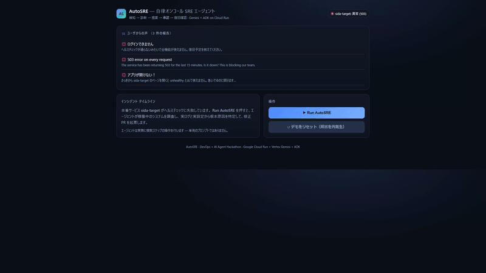

# AutoSRE — an autonomous on-call SRE agent

> **DevOps × AI Agent Hackathon 2026** submission (hosted by Findy, sponsored by Google Cloud).



When a deploy breaks at 2am, someone has to read the logs, find the cause, write the
fix, ship it — and verify it actually recovered. Solo founders and small teams don't
have an on-call SRE for that. **AutoSRE is an AI agent that runs the on-call
investigate-and-repair loop autonomously, and stops for your approval before it
changes anything.**

It even starts where the pain does: AutoSRE reads the **real user reports** (complaints
in the project's issue tracker), correlates them with the live system state, fixes the
root cause, and drafts a reply to the affected users — closing the loop from user pain
to remediation.

**How it differs:** most AI SRE agents trigger from a monitoring *alert* and end
at a *dashboard*. AutoSRE triggers from the **user's voice** and ends by **writing the user
back** — user-pain-in, user-answer-out. (Drafting a fix PR itself is table stakes —
incident.io, Rootly, and Azure SRE Agent do it too; the differentiation is the entry and
exit points of the loop.) Investigate / diagnose / propose are autonomous;
merge + deploy stay behind a human approval gate — the 2026 industry consensus for
irreversible actions (incident.io, Rootly, Azure SRE Agent).

> **On the repo name:** `self-improving-devops-agent` is the north-star (see
> [Roadmap](#roadmap-designed-for-deliberately-out-of-hackathon-scope) — a learned
> per-scenario autonomy policy). The hackathon submission is **AutoSRE**, the working
> foundation that self-improvement would sit on. Named for where it's going; judged on
> what it does today.

**Live demo:** https://sida-agent-860561433627.asia-northeast1.run.app

---

## What it does — five steps, and each one is the product

| Step | What the agent does | Why a single LLM call can't |
|------|---------------------|-----------------------------|
| **Sense** | Reads **real user reports**, probes the target's health, tails **real Cloud Logging**, reads the **deployed Cloud Run config** | Multi-step tool use where each result decides the next action (a ReAct loop) |
| **Diagnose** | Gemini reasons over the real evidence and pinpoints the root cause | Grounded in the actual stack trace + config, not a plausible guess |
| **Propose** | Generates a concrete config fix | — |
| **Gate** | **Pauses for human approval** — the trust boundary | Suspends multi-source state across an unbounded human decision |
| **Verify** | After the fix is applied, polls health until it's green again | observe → act → observe closure — agency, not generation |

The line AutoSRE draws: **read / diagnose / propose = autonomous. Merge + deploy =
always human-approved.**

Every run produces a **real, permanent artifact**: the pull request the agent opened.
See a live example: https://github.com/BERORINPO/sida-target-config/pull/7

### Autonomous trigger — no human needed to start

AutoSRE runs itself — and the whole detection chain is **live, not simulated**. A
**Cloud Monitoring uptime check** watches the target's `/health`; when it fails, the
alert policy publishes to a **Pub/Sub** topic (`autosre-incidents`), whose push
subscription invokes the agent's `POST /pubsub/incident` endpoint (**OIDC-verified**:
Google-signed token, audience + service-account checked). The full
**investigate → diagnose → open-PR** loop runs with **no human click**. Only merge +
deploy wait for a human. (The "Run AutoSRE" button remains for on-demand runs, and
publishing to the topic manually exercises the exact same event path.)

### Measured in production

Numbers from real production runs of this demo scenario (2026-07-07, Cloud Run
request logs + GitHub timestamps) — measured, not projected:

| What | Measured |
|------|----------|
| Full autonomous chain — uptime check 503 → alert → Pub/Sub → OIDC-verified push → agent run → real fix PR, **zero human action** | Fired end-to-end **twice**: [PR #20](https://github.com/BERORINPO/sida-target-config/pull/20), [PR #21](https://github.com/BERORINPO/sida-target-config/pull/21) |
| Agent investigation run — reads real user reports + live Cloud Logging + deployed Cloud Run config, diagnoses, opens a real PR | **27–30 s** (Cloud Run request latencies: 27.3 s / 30.4 s) |
| Pub/Sub event published → fix PR opened | **~90 s** end-to-end |
| After the one human click (Approve) | PR merged, target redeployed, and the agent itself polls `/health` until 503 flips to 200 — recovery verified automatically (150 s poll budget) |

For context: a human on-call engineer paged at 2am typically needs tens of
minutes to read the logs, find the cause, patch, deploy, and verify. These
figures are for this demo scenario — evidence that the loop closes fast, not a
universal MTTR claim.

---

## Architecture

```
   Browser (Incident console, served by agent-service)
        │  POST /incident          POST /approve (human-gated)
        ▼
┌──────────────────────────────────────────────┐
│  agent-service  (Cloud Run, FastAPI + ADK)    │
│  ADK LlmAgent (Gemini 2.5 Flash) ReAct loop   │
│  tools: probe_health, get_recent_logs,        │
│         get_service_config, get_service_status│
│         open_pull_request                     │
└───┬─────────────┬──────────────┬──────────────┘
    │ read logs   │ read/patch   │ open + merge PR
    ▼             ▼              ▼
Cloud Logging   Cloud Run    GitHub (config repo)
                  API              │
                    │              │ on approval: merge
                    ▼              ▼
        ┌───────────────────────────────┐
        │  target-service (Cloud Run)   │  ← the "production" app under incident
        │  /health 503 without config   │
        └───────────────────────────────┘
```

## Tech stack (satisfies both required categories)

- **Google Cloud AI**: **Vertex AI Gemini 2.5 Flash**, driven by the **Google Agent
  Development Kit (ADK, `google-adk>=1.34,<2`)** as a single tool-using ReAct agent.
- **Google Cloud products**: **Cloud Run** (agent-service + target-service),
  **Cloud Logging** (grounded evidence), **Secret Manager** (GitHub token).
- **Backend**: Python 3.12 + FastAPI. **Frontend**: a single self-contained console
  page served by the agent-service (same-origin, no separate deploy).

## Why Gemini (and not just any LLM)

The architecture deliberately keeps the probabilistic core swappable — merge/deploy
runs on a deterministic, LLM-free pipeline — yet Vertex AI Gemini 2.5 Flash is a
considered choice, not a default:

- **Latency is the product.** On-call value decays by the second. The measured
  27–30 s investigation is a direct consequence of Flash's low latency.
- **Production logs never leave the project boundary.** Logs and configs carry
  secrets and PII. Diagnosis runs inside the same GCP project as the workloads:
  no egress to an external LLM API, no API-key lifecycle to manage (auth is ADC
  from the Cloud Run service account), and every model call is captured by Cloud
  Audit Logs. For an SRE tool that reads raw production evidence, that
  auditability bar is hard to meet with any external API.
- **Zero-idle economics.** Pay-per-call Gemini + scale-to-zero Cloud Run keeps a
  24/7 on-call agent at ~$0/month at rest.
- **ADK-native.** The agent is an ADK `LlmAgent` running a multi-step ReAct tool
  loop on Vertex — auth, retries and tool dispatch come from the platform, not
  hand-rolled glue.

## Repository layout

```
packages/agent/
  src/agents/
    server.py        FastAPI app: / (console), /incident, /approve, /target-health, /health, /smoke
    agent.py         ADK ReAct agent (build_agent, run_incident)
    tools.py         read-only investigation tools (Cloud Run + Logging + health probe)
    github_tools.py  open_pull_request (autonomous)
    recovery.py      merge + apply env fix + verify recovery (human-gated)
    static/index.html  the Incident console UI
  Dockerfile         Cloud Run container (uvicorn)
services/target-service/   the demo "production" app that breaks without DATABASE_URL
scripts/
  target-incident.ps1      inject / restore the demo incident
  test_agent_local.py      local end-to-end validation (no Cloud Build)
  test_recovery_local.py   local recovery validation
docs/sprint-4day-autosre.md  the plan + engineering log
```

## Run the demo

```powershell
# 1. break the target (removes DATABASE_URL -> /health 503)
pwsh scripts/target-incident.ps1 -Action inject

# 2. open the console and click "Run AutoSRE", then "Approve & deploy fix"
#    https://sida-agent-860561433627.asia-northeast1.run.app
```

The agent investigates the live service, opens a real fix PR, waits for your approval,
then merges + redeploys the target and confirms `/health` is back to 200.

## Deploy from scratch

See [docs/sprint-4day-autosre.md](docs/sprint-4day-autosre.md) for the full, reproducible
`gcloud run deploy` commands and the Cloud Run gotchas we hit (reserved `/healthz`,
PowerShell env-var quoting, Vertex `global` location).

## Roadmap (designed for, deliberately out of hackathon scope)

These were scoped out to ship one deep, reliable vertical slice in the hackathon window,
but the architecture is built for them:

- **Self-Improving autonomy policy** — learn per-scenario autonomy thresholds from past-incident approve-vs-override rates, with shadow mode, a minimum-sample guard, and never auto-escalating destructive actions. The `confidence` the agent already emits is the seed signal.
- **Multi-Agent Debate** — considered and **deliberately skipped**: 2025 research shows a single grounded agent outperforms debate on well-scoped RCA while adding cost, latency, and JSON-fragility.
- ~~**Full Cloud Monitoring wiring**~~ — **shipped**: a Monitoring uptime check + alert policy + Pub/Sub notification channel are live; the real detection chain (uptime 503 → alert → Pub/Sub → OIDC-verified push → autonomous run → PR) has fired end-to-end in production. Terraform-izing it remains roadmap.
- **Incident history** — Firestore-backed audit trail and dedupe.
- **One-click deploy** — Terraform for the whole stack.
- **More scenarios** — 5xx spikes, memory leaks, dependency CVEs (the tool interface already exposes revisions and status via `get_service_status`).

## License

Apache 2.0 — see [LICENSE](LICENSE).
